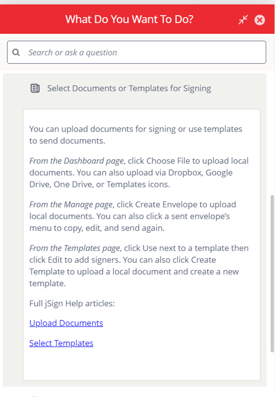

## Problem
Consensus Cloud Solutions had begun partnering with Whatfix to both transition away from single-source, topic-based authoring for external help content and prepare to implement Whatfix, a digital adoption platform, as the primary source of in-app help content on its soon-to-be redesigned web app for its flagship brand. The initial stage in this transition involved learning how to use the Whatfix platform to create help content for jSign, a document signing application with a smaller consumer base than the flagship brand. The [original help documentation](https://docs.jsign.com/help/index.htm) for jSign is nearly exhaustive and would be informative for anyone who reads it. However, its length and organizational complexity present a high bar to clear for most users and make it unusable for Whatfix content. Thus, the primary help content for Whatfix would need to be written from scratch and in a style that was markedly different from what the Technical Documentation team was accustomed to. 

## Solution
I first created a list of article topics based on jSign's most basic, and likely most common, procedures. I then divided the writing tasks among my team and provided a list of **basic writing guidelines** (see below) to help ensure the content was appropriate for the new Whatfix format. After the initial content was written, the Technical Writing team engaged in a peer review process. To ensure the final content functioned properly, I created the display rules for the Whatfix content and widgets that would house the final written pieces. Finally, the team's writing was added to the **formatted Whatfix content** (see below) and made live for all end users. 

 

#### Basic Article Writing Guidelines
{style="color: red"}

- **Write concisely**
  - Microcontent calls for concision rather than lengthy precision.
  - Assume some UI elements/actions are self-explanatory unless we have contradictory data/feedback  
- **Aim for consistency**
  - We will read all articles as a unit before finalizing to ensure consistent terminology, style, etc.
- **Don't use tables**
  - The Help widget isn't wide enough for tables.
  - If a topic calls for a table, we may consider attaching the table as a PDF.
- **Don't use screenshots**
  - Users only access the Help widget while viewing the application. This makes screenshots unnecessary.
- **Don't use complex bullet points**
  - Bullet pointed lists should contain only one level (unlike this one, which contains two)
  - Avoid inserting a bullet pointed list anywhere in a grammatical sentence unless the final bullet completes the sentence.
- **Don't reference other articles**
  - Whatfix articles doesn't support clickable links to other articles or Whatfix content.
  - Information needed to contextualize or complete a process/topic should be included in that article whenever possible. 

Compare the above article to the [original article](https://docs.jsign.com/help/webapp/thedashboardpg/uplddcmts.htm)

## Results

<!--more-->
